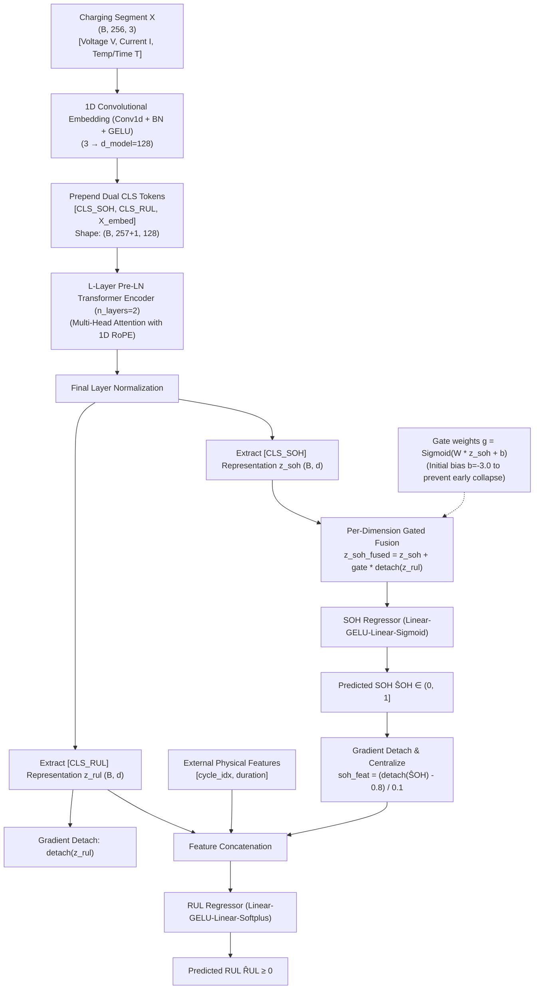

# RoSIP-Batt (R19)

[](https://pytorch.org/)
[](https://opensource.org/licenses/MIT)

Official PyTorch implementation of **RoSIP-Batt (Version R19)**, a deep multi-task learning architecture (**Ro**tary **S**OH-**I**njected **P**rior **Batt**ery Transformer) designed for **Joint State of Health (SOH) and Remaining Useful Life (RUL) Prediction** of lithium-ion batteries using partial charging segments.

---

## Key Highlights & Innovations (R19)

R19 introduces several advanced neural architectures specifically designed to solve the challenges of battery degradation modeling:

1. **SOH Explicit Injection (SOH-to-RUL Prior Flow)**: 
   SOH decline represents the physical loss of active lithium/materials, which dictates the future EOL cycle. R19 feeds the predicted $\hat{y}_{\text{SOH}}$ (with gradient detachment and scale centralization) directly into the RUL head as a physical prior constraint.
2. **Rotary Position Embedding (RoPE)**:
   Replaces absolute position encodings with 1D Rotary Position Embeddings. RoPE preserves relative step relationships, which makes the model robust against random charging start voltages, variable charging lengths, and partial/truncated charging profiles.
3. **Dual [CLS] Tokens & Gated Feature Fusion**:
   Separate `[CLS_SOH]` and `[CLS_RUL]` tokens extract task-specific features, which are then combined using a dimension-level gated fusion layer $\mathbf{z}_{\text{SOH, fused}} = \mathbf{z}_{\text{SOH}} + \mathbf{g} \odot \text{detach}(\mathbf{z}_{\text{RUL}})$, preventing negative task transfer.
4. **Homoscedastic Uncertainty-Weighted Multi-Task Loss**:
   Uses learnable parameters $s_{\text{SOH}}$ and $s_{\text{RUL}}$ to dynamically balance the loss scales of SOH (bounded in $[0.7, 1.0]$) and RUL (unbounded scale).

---

## Model Architecture Topology



---

## Directory Structure

```
open access/
├── .gitignore
├── README.md
├── requirements.txt
├── setup.py
├── configs/
│   └── default.yaml         # Optimized R19 model hyperparameter configuration
├── models/
│   ├── __init__.py
│   ├── mtl_model.py         # Main R19 MTL model framework
│   ├── transformer.py       # Pre-LN Transformer Encoder with RoPE
│   ├── rope.py              # Rotary Position Embedding cache & operator
│   ├── heads.py             # Dedicated SOH (Sigmoid) and RUL (Softplus) heads
│   └── losses.py            # Uncertainty weighted multi-task loss implementation
├── data/
│   ├── __init__.py
│   ├── dataset.py           # Battery Dataset class & oversampler
│   ├── preprocessing.py     # Resampling & CC window extraction helpers
│   ├── pkl_loader.py        # Dataset pickle files loader (NASA, CALCE, etc.)
│   └── placeholder.txt      # Place datasets files in this directory
└── scripts/
    ├── train.py             # Single-GPU/CPU training and validation runner
    └── evaluate.py          # Trajectory inference, metric report & plotting
```

---

## Mathematical Formulation

### 1. Homoscedastic Uncertainty Weighting
For joint SOH and RUL regression, we define the learning objective using a Bayesian interpretation of multi-task loss:
$$\mathcal{L}(\theta, s_{\text{SOH}}, s_{\text{RUL}}) = \frac{1}{2} \exp(-s_{\text{SOH}}) \mathcal{L}_{\text{SOH}} + \frac{1}{2} \exp(-s_{\text{RUL}}) \mathcal{L}_{\text{RUL}} + \frac{1}{2} s_{\text{SOH}} + \frac{1}{2} s_{\text{RUL}}$$
where $s_{\text{SOH}} = \log(\sigma^2_{\text{SOH}})$ and $s_{\text{RUL}} = \log(\sigma^2_{\text{RUL}})$ are learnable parameters acting as adaptive task weights.

### 2. SOH Injection
To provide RUL head with SOH physical state constraint without interfering with SOH gradient paths:
$$\text{soh\_feat} = \frac{\text{detach}(\hat{y}_{\text{SOH}}) - 0.8}{0.1}$$
$$\hat{y}_{\text{RUL}} = \text{Softplus}\left(\mathbf{W}_2 \cdot \text{GELU}(\mathbf{W}_1 \cdot [\mathbf{z}_{\text{RUL}}; \mathbf{x}_{\text{extra}}; \text{soh\_feat}] + \mathbf{b}_1) + \mathbf{b}_2\right)$$

---

## Installation

Ensure you have Python 3.8+ and PyTorch installed.

```bash
# Clone the repository
git clone https://github.com/shuhaochen618-svg/RoSIP-Batt.git
cd RoSIP-Batt

# Install dependencies
pip install -r requirements.txt

# Install the library in editable mode
pip install -e .
```

---

## Dataset Setup

As this open-source release does not package data files directly, download public battery datasets and place them under the `data/` folder:

1. **NASA PCoE Dataset**: Put `.pkl` files (e.g. `NASA_B0005.pkl`, etc.) under `data/NASA/`.
2. **CALCE Dataset**: Put `.pkl` files (e.g. `CALCE_CS2_35.pkl`, etc.) under `data/CALCE/`.
3. **MIT-Stanford Dataset**: Put `.pkl` files under `data/Stanford/`.
4. **HUST Dataset**: Put `.pkl` files under `data/HUST/`.

File structures:
```
data/
├── NASA/
│   ├── NASA_B0005.pkl
│   └── ...
├── CALCE/
│   ├── CALCE_CS2_35.pkl
│   └── ...
└── Stanford/
    └── ...
```

---

## How to Run

### 1. Training the Model
Train the model on a specific dataset (e.g., NASA) using the default configuration file:
```bash
python scripts/train.py --dataset NASA --data-root ./data --device cuda
```

### 2. Evaluating a Checkpoint
Evaluate your saved model checkpoint, calculate metrics on test sets, and generate prediction charts:
```bash
python scripts/evaluate.py --checkpoint ./results/best_model_NASA.pth --data-root ./data --device cuda
```
Saved plots will be located at `./results/plots/`.
